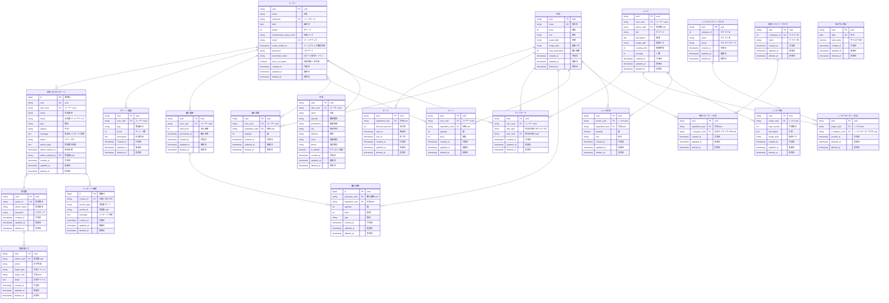

```mermaid
erDiagram
    users ||--o{ addresses : ""
    users ||--o{ saved_items : ""
    users ||--o{ saved_for_later : ""
    users ||--o{ cart_items : ""
    users ||--o{ purchase_history : ""
    users ||--o{ point_histories : ""
    users ||--o{ contacts : ""
    
    recipes ||--o{ recipe_ingredients : ""
    recipes ||--o{ recipe_steps : ""
    recipes ||--o{ recipe_categories : ""
    recipes ||--o{ saved_items : ""
    
    r_categories ||--o{ recipe_categories : ""
    
    ingredients ||--o{ recipe_ingredients : ""
    ingredients ||--o{ ingredients_categories : ""
    ingredients ||--o{ cart_items : ""
    ingredients ||--o{ purchase_details : ""
    ingredients ||--o{ saved_items : ""
    ingredients ||--o{ saved_for_later : ""
    ingredients ||--o| sales : ""
    
    i_categories ||--o{ ingredients_categories : ""
    
    purchase_history ||--o{ purchase_details : ""
    
    contacts ||--o{ contact_messages : ""
    contacts }o--|| admins : ""
    
    admins ||--o{ admin_logs : ""

    users[ユーザー] {
        string uuid PK "uuid"
        string name "氏名"
        string nickname UK "ニックネーム"
        date birth "誕生日"
        int points "ポイント"
        string membership_status_code "会員ランク"
        string email UK "メールアドレス"
        timestamp email_verified_at "メールアドレス確認日時"
        string password "パスワード"
        string remember_token "ログイン保持トークン"
        boolean terms_accepted "利用規約への同意"
        timestamp created_at "作成日"
        timestamp updated_at "更新日"
        timestamp deleted_at "削除日"
    }
    
    addresses[住所] {
        string uuid PK "uuid"
        string user_uuid FK "ユーザーuuid"
        string name "氏名"
        string zipcode "郵便番号"
        string prefectures "都道府県"
        string city "市区町村"
        string address "番地"
        string room "部屋番号"
        string phone "電話番号"
        boolean is_default "デフォルト設定"
        timestamp created_at "作成日"
        timestamp updated_at "更新日"
        timestamp deleted_at "削除日"
    }
    
    recipes[レシピ] {
        string uuid PK "uuid"
        string user_uuid FK "ユーザーuuid"
        string admin_uuid FK "管理者uuid"
        string title "タイトル"
        text description "概要"
        string image_path "画像パス"
        int cooking_time "調理時間"
        int servings "人数"
        timestamp created_at "作成日"
        timestamp updated_at "更新日"
        timestamp deleted_at "削除日"
    }
    
    ingredients[材料] {
        string uuid PK "uuid"
        string name UK "材料名"
        int price "値段"
        string unit "単位"
        string seasonality "季節"
        string image_path "画像パス"
        int total_purchased "購入総数"
        timestamp created_at "作成日"
        timestamp updated_at "更新日"
        timestamp deleted_at "削除日"
    }
    
    recipe_ingredients[レシピ材料] {
        string uuid PK "uuid"
        string recipe_uuid FK "レシピuuid"
        string ingredient_uuid FK "材料uuid"
        decimal quantity "量"
        string unit "単位"
        timestamp created_at "作成日"
        timestamp updated_at "更新日"
        timestamp deleted_at "削除日"
    }
    
    recipe_steps[レシピ手順] {
        string uuid PK "uuid"
        string recipe_uuid FK "レシピuuid"
        int step_number "手順番号"
        text description "手順"
        string image_path "画像パス"
        timestamp created_at "作成日"
        timestamp updated_at "更新日"
        timestamp deleted_at "削除日"
    }

    r_categories[レシピカテゴリーマスタ] {
        string uuid PK "uuid"
        int category_id "カテゴリID"
        string name "カテゴリ名"
        string group "カテゴリグループ"
        timestamp created_at "作成日"
        timestamp updated_at "更新日"
        timestamp deleted_at "削除日"
    }

    recipe_categories[レシピカテゴリー対応] {
        string uuid PK "uuid"
        string recipe_uuid FK "レシピuuid"
        string r_category_uuid FK "レシピカテゴリマスタuuid"
        timestamp created_at "作成日"
        timestamp updated_at "更新日"
        timestamp deleted_at "削除日"
    }
    
    i_categories[材料カテゴリーマスタ] {
        string uuid PK "uuid"
        int i_category_id UK "カテゴリID"
        string name "カテゴリ名"
        timestamp created_at "作成日"
        timestamp updated_at "更新日"
        timestamp deleted_at "削除日"
    }

    ingredients_categories[材料カテゴリー対応] {
        string uuid PK "uuid"
        string ingredient_uuid FK "材料uuid"
        string i_category_uuid FK "材料カテゴリマスタuuid"
        timestamp created_at "作成日"
        timestamp updated_at "更新日"
        timestamp deleted_at "削除日"
    }
    
    cart_items[カート] {
        string uuid PK "uuid"
        string user_uuid FK "ユーザーuuid"
        string ingredient_uuid FK "材料uuid"
        int quantity "量"
        int price "値段"
        timestamp created_at "作成日"
        timestamp updated_at "更新日"
        timestamp deleted_at "削除日"
    }
    
    saved_items[ブックマーク] {
        string uuid PK "uuid"
        string user_uuid FK "ユーザーuuid"
        string item_type "保存対象のモデルクラス"
        string item_uuid FK "保存対象のuuid"
        timestamp created_at "作成日"
        timestamp updated_at "更新日"
        timestamp deleted_at "削除日"
    }

    saved_for_later[購入保留] {
        string uuid PK "uuid"
        string user_uuid FK "ユーザーuuid"
        string ingredient_uuid FK "材料uuid"
        int quantity "量"
        timestamp created_at "作成日"
        timestamp updated_at "更新日"
        timestamp deleted_at "削除日"
    }
    
    purchase_history[購入履歴] {
        string uuid PK "uuid"
        string user_uuid FK "ユーザーuuid"
        int total_price "合計金額"
        timestamp purchased_at "購入日時"
        timestamp created_at "作成日"
        timestamp updated_at "更新日"
        timestamp deleted_at "削除日"
    }
    
    purchase_details[購入明細] {
        bigint id PK "uuid"
        string purchase_uuid FK "購入履歴uuid"
        string ingredient_uuid FK "材料uuid"
        int quantity "量"
        int price "値段"
        string type "種別"
        timestamp created_at "作成日"
        timestamp updated_at "更新日"
        timestamp deleted_at "削除日"
    }
    
    sales[セール] {
        string uuid PK "uuid"
        string ingredient_uuid FK "材料uuid"
        int discount_percent "割引率"
        timestamp start_at "開始日"
        timestamp end_at "終了日"
        timestamp created_at "作成日"
        timestamp updated_at "更新日"
        timestamp deleted_at "削除日"
    }

    daily_sales[日次売上集計] {
        string uuid PK "uuid"
        date date UK "日付"
        decimal total_sales "売り上げ合計"
        timestamp created_at "作成日"
        timestamp updated_at "更新日"
        timestamp deleted_at "削除日"
    }
    
    point_histories[ポイント履歴] {
        string uuid PK "uuid"
        string user_uuid FK "ユーザーuuid"
        string type "増減区分"
        int points "ポイント数"
        text description "処理内容"
        timestamp created_at "作成日"
        timestamp updated_at "更新日"
        timestamp deleted_at "削除日"
    }
    
    contacts[お問い合わせチケット] {
        bigint id PK "連番ID"
        string uuid UK "uuid"
        string user_uuid FK "ユーザーuuid"
        string name "送信者名"
        string email "送信者メールアドレス"
        string type "種別"
        string subject "件名"
        text message "最初のメッセージ内容"
        string status "ステータス"
        text admin_reply "管理者の返信"
        timestamp admin_replied_at "返信日時"
        string admin_replied_by FK "管理者uuid"
        timestamp created_at "作成日"
        timestamp updated_at "更新日"
        timestamp deleted_at "削除日"
    }
    
    contact_messages[メッセージ履歴] {
        bigint id PK "連番ID"
        string contact_id FK "お問い合わせID"
        string sender_type "送信者タイプ"
        string sender_id "送信者uuid"
        text message "メッセージ内容"
        timestamp created_at "作成日"
        timestamp updated_at "更新日"
        timestamp deleted_at "削除日"
    }
    
    admins[管理者] {
        string uuid PK "uuid"
        string admin_id UK "管理者ID"
        string admin_name "管理者名"
        string password "パスワード"
        timestamp created_at "作成日"
        timestamp updated_at "更新日"
        timestamp deleted_at "削除日"
    }
    
    admin_logs[管理者ログ] {
        string uuid PK "uuid"
        string admin_uuid FK "管理者uuid"
        string action "実行内容"
        string target_type "対象ジャンル"
        string target_uuid "対象uuid"
        text detail "対象タイトル"
        timestamp created_at "作成日"
        timestamp updated_at "更新日"
        timestamp deleted_at "削除日"
    }
    
```
