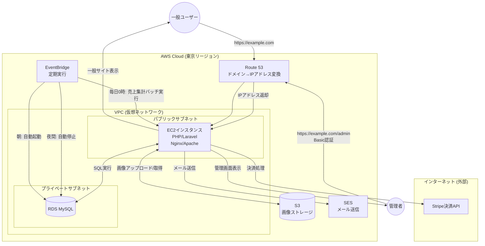

```mermaid
graph TD
    %% アクターの定義
    User((一般ユーザー))
    Admin((管理者))

    subgraph Internet ["インターネット (外部)"]
        Stripe[Stripe決済API]
    end

    subgraph AWS_Cloud ["AWS Cloud (東京リージョン)"]
        R53[Route 53<br/>ドメイン→IPアドレス変換]
        
        subgraph VPC ["VPC (仮想ネットワーク)"]
            subgraph Public_Subnet ["パブリックサブネット"]
                EC2[EC2インスタンス<br/>PHP/Laravel<br/>Nginx/Apache]
            end

            subgraph Private_Subnet ["プライベートサブネット"]
                RDS[(RDS MySQL)]
            end
        end

        %% AWSマネージドサービス
        S3[(S3<br/>画像ストレージ)]
        SES[SES<br/>メール送信]
        EB[EventBridge<br/>定期実行]
    end

    %% ユーザーの流れ
    User -- "https://example.com" --> R53
    R53 -- "IPアドレス返却" --> EC2
    EC2 -- "一般サイト表示" --> User

    %% 管理者の流れ
    Admin -- "https://example.com/admin<br/>Basic認証" --> R53
    R53 --> EC2
    EC2 -- "管理画面表示" --> Admin

    %% 内部連携
    EC2 <-- "SQL実行" --> RDS
    EC2 <-- "画像アップロード/取得" --> S3
    EC2 -- "決済処理" --> Stripe
    EC2 -- "メール送信" --> SES

    %% 自動化
    EB -- "毎日0時: 売上集計バッチ実行" --> EC2
    EB -- "夜間: 自動停止" --> RDS
    EB -- "朝: 自動起動" --> RDS
```
